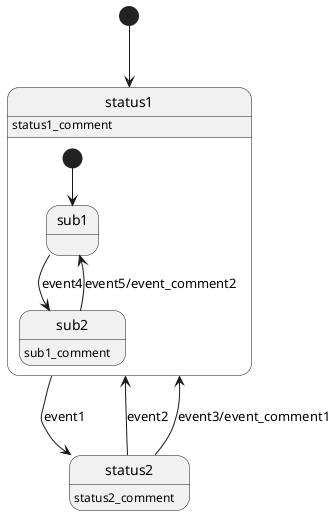

# BufferFlowX 状态机（FSM）组件使用指南

## 简介

BufferFlowX 状态机（FSM）组件是一个基于PlantUML状态图生成C代码的工具链。它允许开发者使用图形化的方式设计状态机，然后自动生成高效的C代码实现，支持嵌套状态和事件处理。

### 主要功能

- **PlantUML状态图转换**：将PlantUML语法描述的状态机转换为C代码
- **嵌套状态支持**：支持层次化状态结构，子状态无法处理事件时会上升到父状态
- **表驱动实现**：生成基于状态转换表的高效状态机执行引擎
- **事件处理机制**：支持事件驱动的状态转换和动作执行

## 核心概念

### 术语解释

- **状态（State）**：系统在特定时间点的条件或情况
- **事件（Event）**：触发状态转换的外部或内部信号
- **状态转换（Transition）**：从一个状态到另一个状态的改变
- **嵌套状态（Nested State）**：包含子状态的复合状态
- **状态转换表**：描述状态、事件和目标状态关系的数据结构

### 目录结构

```
bfx/fsm/
├── bfx_fsm.c          # 状态机运行时引擎实现
├── bfx_fsm.h          # 状态机API接口定义
├── bfx_puml_translate.py  # PlantUML到C代码转换脚本
└── design.md          # 设计文档
```

## 快速开始

### 1. 设计状态机

使用PlantUML语法定义状态机，例如创建一个`example.puml`文件：



### 2. 生成C代码

使用`bfx_puml_translate.py`脚本将PlantUML文件转换为C代码：

```bash
python bfx/fsm/bfx_puml_translate.py example.puml
```

这将生成对应的`.h`和`.c`文件。

### 3. 集成到项目

在项目中包含生成的头文件和源文件，并使用状态机API：

```c
#include "exampleProj.h"  // 生成的头文件

// 初始化状态机句柄
BFX_FSM_HANDLE fsm_handle = {
    .stateTbl = g_exampleProj_allstatus,  // 生成的转换表
    .stateCnt = 4,  // 状态数量
    .currentStateId = EXAMPLEPROJ_STATUS1,  // 初始状态
};

// 处理事件
BFX_FsmProcessEvent(&fsm_handle, EXAMPLEPROJ_EVENT1, NULL, 0);

// 获取当前状态
uint8_t current_state = BFX_FsmGetCurrentStateID(&fsm_handle);
```

## 详细使用指南

### PlantUML语法规范

#### 基本语法

- 状态定义：`state_name: description`
- 初始状态：`[*] --> state_name`
- 状态转换：`state1 --> state2 : event_name`
- 带动作的转换：`state1 --> state2 : event_name/action_comment`
- 嵌套状态：在state块内定义子状态

#### 限制条件

- 不支持分支、并发、历史等高级功能
- 每个状态都必须有声明
- 嵌套状态必须用`[*] ->`指明初始状态
- 不支持终止状态`->[*]`
- 状态和事件名称不允许携带非法符号（如.$%+-*/等）

### API函数详解

#### BFX_FsmProcessEvent

处理状态机中的事件：

```c
uint8_t BFX_FsmProcessEvent(BFX_FSM_HANDLE *handle, uint8_t event, void *arg, uint16_t argSize);
```

- `handle`：状态机句柄指针
- `event`：要处理的事件ID
- `arg`：与事件关联的参数指针
- `argSize`：参数大小（字节）
- 返回值：0表示事件处理成功，1表示失败

#### BFX_FsmGetCurrentStateID

获取当前状态ID：

```c
uint8_t BFX_FsmGetCurrentStateID(BFX_FSM_HANDLE *handle);
```

- `handle`：状态机句柄指针
- 返回值：当前状态ID

#### BFX_FsmResetTo

重置状态机到指定状态：

```c
uint8_t BFX_FsmResetTo(BFX_FSM_HANDLE *handle, uint8_t stateID);
```

- `handle`：状态机句柄指针
- `stateID`：要重置到的状态ID
- 返回值：0表示重置成功，1表示失败

### 状态转换机制

#### 嵌套状态事件处理

当子状态无法处理某个事件时，系统会自动将事件向上传递给父状态处理，直到根状态。这种机制确保了事件能够被适当处理。

#### 转换表结构

生成的转换表使用表驱动方式实现，包含以下结构：

- 状态ID映射
- 事件ID映射
- 状态转换记录表
- 动作回调函数

## 高级特性

### 嵌套状态处理

支持复杂的层次化状态结构，每个状态可以包含子状态。子状态可以处理特定事件，未处理的事件会向父状态传递。

### 动作回调

每个状态可以定义动作回调函数，在状态转换时执行特定操作。

### 表驱动优化

使用静态定义的转换表，确保状态转换的高效执行，适用于资源受限的嵌入式环境。

## 最佳实践

1. **合理设计状态层次**：避免过深的嵌套状态，保持状态机结构清晰
2. **使用有意义的命名**：状态和事件名称应具有描述性
3. **考虑所有状态转换**：确保所有可能的事件都有适当的处理
4. **测试状态转换**：验证所有状态转换路径的正确性
5. **使用注释**：为复杂的状态机添加充分的注释说明

## 常见问题解答

### Q: 如何处理无法识别的事件？
A: 状态机将返回1表示事件处理失败。建议在应用层处理未识别事件的逻辑。

### Q: 嵌套状态的事件处理顺序是怎样的？
A: 事件首先在当前子状态处理，如果子状态无法处理，则传递给父状态，直到根状态。

### Q: 如何重置状态机到初始状态？
A: 使用BFX_FsmResetTo函数，传入初始状态的ID。

## 故障排除

如果遇到问题，请检查：

1. PlantUML语法是否符合规范
2. 状态和事件名称是否包含非法字符
3. 是否正确初始化了状态机句柄
4. 生成的转换表是否正确链接到项目中
5. 事件ID是否在有效范围内

## 注意事项

1. 确保PlantUML文件符合语法规范，特别是嵌套状态的初始状态声明
2. 状态ID从1开始编号，0有特殊含义
3. 在资源受限的环境中，注意状态转换表的内存占用
4. 动作回调函数应尽可能简单，避免阻塞操作